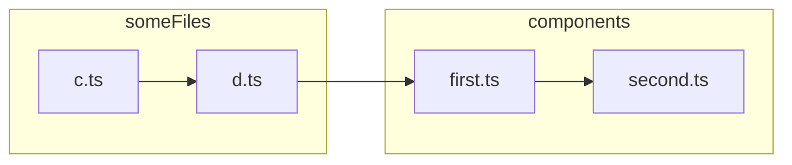

# deno_graph

[](https://doc.deno.land/https://deno.land/x/deno_graph/mod.ts)

This repository includes a compiled version of the Rust crate as Web Assembly
and exposes an interface which is available via the `mod.ts` in this repository
and can be imported like:

```js
import * as denoGraph from "https://deno.land/x/deno_graph@{VERSION}/mod.ts";
```

Where `{VERSION}` should be substituted with the specific version you want to
use.

### `createGraph()`

The `createGraph()` function allows a module graph to be built asynchronously
and returns a single JavaScript object containing the module graph information.
It requires a root specifier or any array of root specifiers to be passed, which
will serve as the roots of the module graph.

There are several options that can be passed the function in the optional
`options` argument:

- `load` - a callback function that takes a URL string and a flag indicating if
  the dependency was required dynamically (e.g.
  `const m = await import("mod.ts")`) and resolves with a `LoadResponse`. By
  default a `load()` function that will attempt to load local modules via
  `Deno.readFile()` and load remote modules via `fetch()`.
- `cacheInfo` - a callback function that takes a URL string and returns a
  `CacheInfo` object. In the Deno CLI, the `DENO_DIR` cache info is passed back
  using this interface. If the function is not provided, the information is not
  present in the module graph.
- `resolve` - a callback function that takes a string and a referring URL string
  and returns a fully qualified URL string. In the Deno CLI, import maps provide
  this callback functionality of potentially resolving modules differently than
  the default resolution.
- `resolveTypes` - a callback function that takes a URL string and returns the
  types dependency for the specifier, along with optionally the source of the
  types dependency. This only gets called in situations where the module is
  potentially untyped (e.g. JavaScript, JSX) and no other type dependency was
  detected. This is intended to enrich the module graph with external types that
  are resolved in some other fashion, like from a `package.json` or via
  detecting an `@types` typings package is available.

## Exploring the Entire Dependency Graph

Imagine we have a project like this:

```bash
tree
.
├── components
│   ├── first.ts
│   └── second.ts
├── deno.json
└── someFiles
    ├── c.ts
    └── d.ts
```

with the following contents:

- <details><summary>c.ts</summary>

  ```ts
  import { foo } from "@/someFiles/d.ts";

  console.log(foo);
  ```
  </details>
- <details><summary>d.ts</summary>

  ```ts
  import { val1 } from "@/components/first.ts";

  console.log("from d.ts");
  console.log({ val1 });

  export const foo = "foo";
  ```
  </details>
- <details><summary>first.ts</summary>

  ```ts
  import { val2 } from "./second.ts";

  console.log("from first.ts");
  console.log({ val2 });

  export const val1 = 2;
  ```
  </details>
- <details><summary>second.ts</summary>

  ```ts
  export const val2 = 2;
  ```
  </details>
- <details><summary>deno.json</summary>

  ```json
  {
    "imports": {
      "@/": "./"
    }
  }
  ```
  </details>

You can visualize the dependency graph like this:



Let's see if we can see all these dependencies with the following snippet:

```ts
import { createGraph } from "https://deno.land/x/deno_graph@0.63.6/mod.ts";
import { resolve, toFileUrl } from "https://deno.land/std@0.212.0/path/mod.ts";
const path = resolve("./someFiles/c.ts");
const graph = await createGraph(toFileUrl(path).href);
console.log(graph);
```

We get the following output:

```js
{
  roots: [
    "file:///my/absolute/path/someFiles/c.ts"
  ],
  modules: [
    {
      kind: "esm",
      dependencies: [ { specifier: "@/someFiles/d.ts", code: [Object] } ],
      size: 58,
      mediaType: "TypeScript",
      specifier: "file:///my/absolute/path/someFiles/c.ts"
    }
  ],
  redirects: {}
}
```

Hmmm, that didn't go as well as hoped. It looks like we didn't traverse any of
the transitive dependencies! Let's try again, but this time using the fantastic
[`import_map`](https://github.com/denoland/import_map) project, which is used by
the Deno CLI to resolve import maps.

We'll load our import map from `deno.json` and then resolve it, using the root
of our project (in this case, wherever the `deno.json` file is located). This
library provides a `resolve` function which we can pass to `createGraph`.

```ts
import { createGraph } from "https://deno.land/x/deno_graph@0.63.6/mod.ts";
import { resolve, toFileUrl } from "https://deno.land/std@0.212.0/path/mod.ts";
import { parseFromJson } from "https://deno.land/x/import_map@v0.18.3/mod.ts";

const path = resolve("./someFiles/c.ts");
const importMap =
  (await import("./deno.json", { with: { type: "json" } })).default;
const resolvedImportMap = await parseFromJson(
  toFileUrl(resolve("deno.json")),
  importMap,
);
const graph = await createGraph(toFileUrl(path).href, {
  resolve: resolvedImportMap.resolve.bind(resolvedImportMap),
});
console.log(graph);
```

Now we see the following output:

```js
{
  roots: [
    "file:///my/absolute/path/someFiles/c.ts"
  ],
  modules: [
    {
      kind: "esm",
      dependencies: [ { specifier: "./second.ts", code: [Object] } ],
      size: 114,
      mediaType: "TypeScript",
      specifier: "file:///my/absolute/path/components/first.ts"
    },
    {
      kind: "esm",
      size: 23,
      mediaType: "TypeScript",
      specifier: "file:///my/absolute/path/components/second.ts"
    },
    {
      kind: "esm",
      dependencies: [ { specifier: "@/someFiles/d.ts", code: [Object] } ],
      size: 58,
      mediaType: "TypeScript",
      specifier: "file:///my/absolute/path/someFiles/c.ts"
    },
    {
      kind: "esm",
      dependencies: [ { specifier: "@/components/first.ts", code: [Object] } ],
      size: 123,
      mediaType: "TypeScript",
      specifier: "file:///my/absolute/path/someFiles/d.ts"
    }
  ],
  redirects: {}
}
```

Now we've properly discovered all the transitive dependencies, _and_ they've
been given to us as fully qualified URLs. Great!
